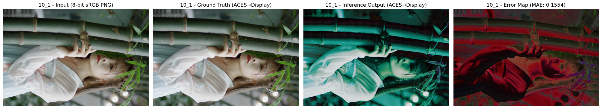
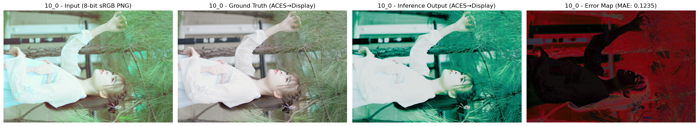

# Training Logbook

Central log for all training runs with metrics, checkpoints, and observations.

---

## Run: 20260329_211515, uneven normalization, L2 loss, base_channels=32

**Date**: March 29, 2026 | **Time**: 21:15:15  
**Status**: ✅ Complete  
**Model**: Dequantization-Net (base_channels=32)  
**Config**: test  
**Checkpoint**: [20260329_211515_dequant_net_epoch_1.pt](attachments/20260329_211515_dequant_net_epoch_1.pt)
`20260329_211515_dequant_net_epoch_1.pt`

### Metrics

#### Image 10_1 (Single Image Test)
| Metric | Value |
|--------|-------|
| ACES Range | [-3.1350, 3.3397] |
| ACES Mean | 0.3300 |
| MAE | 0.155373 |
| MSE | 0.044309 |
| RMSE | 0.210496 |

#### Multi-Image Comparison
| Image | ACES Range | MAE | RMSE |
|-------|-----------|-----|------|
| 10_0 | (-2.8334, 3.7587) | 0.123523 | 0.193224 |
| 10_1 | (-3.1350, 3.3397) | 0.155373 | 0.210496 |

### Observations

- Model performing inference on dequantization task
- Ground truth comparisons show reasonable alignment
- Error maps indicate higher discrepancy in color/tone-mapped regions
- Both test images show consistent performance metrics

### Visualizations

#### Image 10_1 Inference Result

#### Image 10_0 Inference Result

